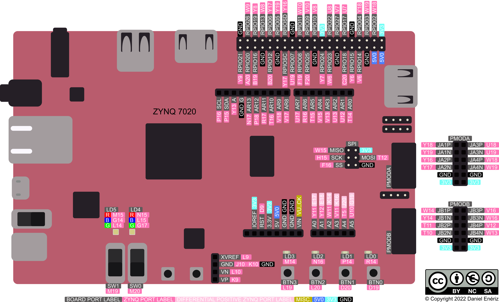
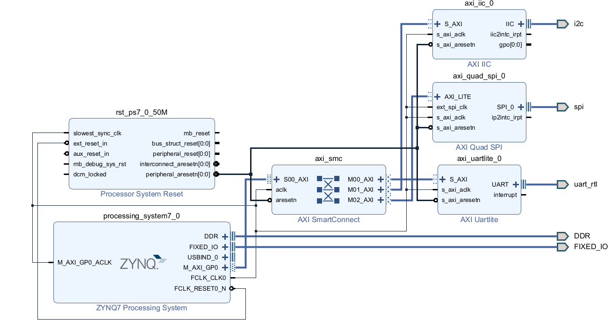
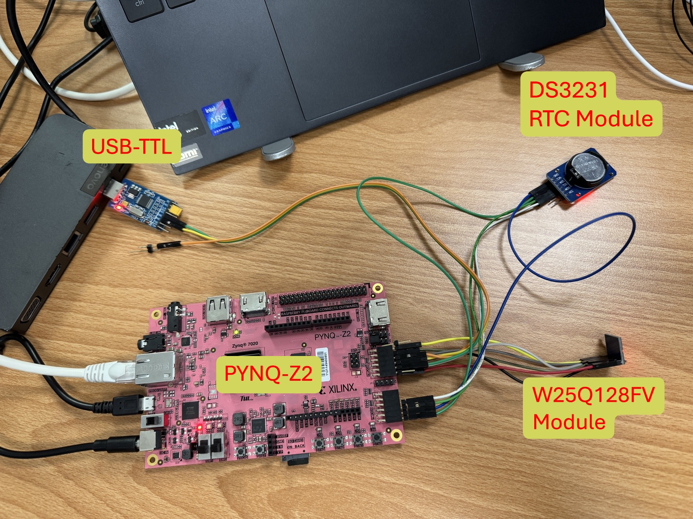

# PYNQ Communication Examples

This project demonstrates how to use various communication interfaces (UART, I2C, and SPI) with PYNQ on the PYNQ-Z2 board. The project includes Vivado hardware design files and Jupyter notebook examples for each communication protocol.



## System Architecture



## My setup



## Overview

This repository contains examples for interfacing with external devices using:
- **UART**: Serial communication at 9600 baud via USB-TTL module
- **I2C**: Communication with DS3231 RTC (Real-Time Clock) module
- **SPI**: Communication with W25Q128 SPI Flash memory

## Hardware Requirements

- PYNQ-Z2 Development Board
- External devices for testing:
  - USB-TTL module for UART communication
  - I2C RTC module (DS3231)
  - SPI Flash memory (Winbond W25Q128)

## Project Structure

```
pynq-examples/
├── README.md                    # This file
├── top_wrapper.xsa             # Hardware specification file
├── pin.xdc                     # Pin constraints file
├── uart.ipynb                  # UART communication examples
├── iic.ipynb                   # I2C communication examples
├── spi.ipynb                   # SPI communication examples
├── figures/                    # Documentation images
│   ├── block-diagram.png       # System block diagram
│   └── pynq-z2.png            # PYNQ-Z2 board image
└── project_1/                 # Vivado project files
    ├── project_1.xpr          # Main Vivado project
    └── ...                    # Generated project files
```

## Pin Assignments

The following pin assignments are used for the communication interfaces:

### UART (9600 baud)
- **RXD**: Pin Y16 (LVCMOS33)
- **TXD**: Pin Y17 (LVCMOS33)

### I2C
- **SCL**: Pin T11 (LVCMOS33, Pull-up enabled)
- **SDA**: Pin T10 (LVCMOS33, Pull-up enabled)

### SPI
- **MOSI**: Pin U18 (LVCMOS33)
- **MISO**: Pin U19 (LVCMOS33)
- **SCLK**: Pin W18 (LVCMOS33)
- **CS**: Pin W19 (LVCMOS33)

## Getting Started

### Prerequisites

1. PYNQ image installed on PYNQ-Z2 board
2. Jupyter notebook environment running
3. Required Python packages:
   - `pynq`
   - `time`

### Hardware Setup

1. **Load the bitstream**: Copy `top_wrapper.xsa` to your PYNQ board
2. **Connect external devices** according to the pin assignments above
3. **Power on** the PYNQ-Z2 board

### Software Setup

1. Upload the notebook files to your PYNQ board
2. Open Jupyter Lab/Notebook interface
3. Navigate to the example notebooks

## Usage Examples

### UART Communication (`uart.ipynb`)

The UART example demonstrates:
- Initializing AXI UART Lite IP core
- Sending and receiving data over UART
- Custom `UartAXI` class for simplified UART operations

Key features:
- 9600 baud rate communication
- FIFO management
- Timeout handling

```python
# Basic usage
uart = UartAXI(0x42C00000)
uart.setupCtrlReg()
uart.write('HELLO\r\n')
data = uart.read(5)
```

### I2C Communication (`iic.ipynb`)

The I2C example demonstrates:
- Reading time from DS3231 RTC module
- BCD to integer conversion
- Using PYNQ's built-in AxiIIC class

Key features:
- RTC time reading from DS3231
- Date and time formatting
- I2C device communication at address 0x68

```python
# Read current time from DS3231 RTC
iic.send(0x68, bytes([0x00]), 1)    # Set register pointer
iic.receive(0x68, rx_data, 7)       # Read 7 bytes
# Convert BCD to readable format
```

### SPI Communication (`spi.ipynb`)

The SPI example demonstrates:
- Reading JEDEC ID from W25Q128 SPI Flash memory
- Manual chip select control
- Low-level SPI register operations

Key features:
- JEDEC ID reading (0x9F command)
- Manual slave select control
- W25Q128 Flash memory identification

```python
# Read JEDEC ID from W25Q128 SPI Flash
spi.write(SPIDTR, 0x9F)    # Send JEDEC ID command
# Read 3-byte response
# Expected: [0xEF, 0x40, 0x18] for Winbond W25Q128
```

## Hardware Design

The Vivado project (`project_1/`) includes:
- **AXI UART Lite**: For serial communication
- **AXI IIC**: For I2C communication
- **AXI Quad SPI**: For SPI communication
- **Processing System**: Zynq PS configuration
- **Interconnect**: AXI interconnect for IP integration

### IP Core Addresses
- UART: `0x42C00000`
- I2C: Check `ol.ip_dict['axi_iic_0']`
- SPI: `0x41E00000`

## Troubleshooting

### Common Issues

1. **No communication**: 
   - Check pin connections
   - Verify voltage levels (3.3V)
   - Ensure proper grounding

2. **UART not working**:
   - Verify baud rate (9600)
   - Check RX/TX pin connections
   - Ensure proper logic levels

3. **I2C timeout**:
   - Check pull-up resistors on SCL/SDA
   - Verify device address (0x68 for DS3231 RTC)
   - Ensure proper power supply to I2C device

4. **SPI no response**:
   - Check SPI mode configuration
   - Verify chip select polarity
   - Ensure proper clock settings

## Development Notes

- All examples use memory-mapped I/O (MMIO) for direct register access
- Hardware debugging can be done through Vivado's Integrated Logic Analyzer (ILA)
- The project supports both simulation and hardware implementation

## Contributing

Feel free to submit issues and enhancement requests!

## References

- [AXI Quad SPI LogiCORE IP Product Guide (PG153)](https://docs.amd.com/r/en-US/pg153-axi-quad-spi)